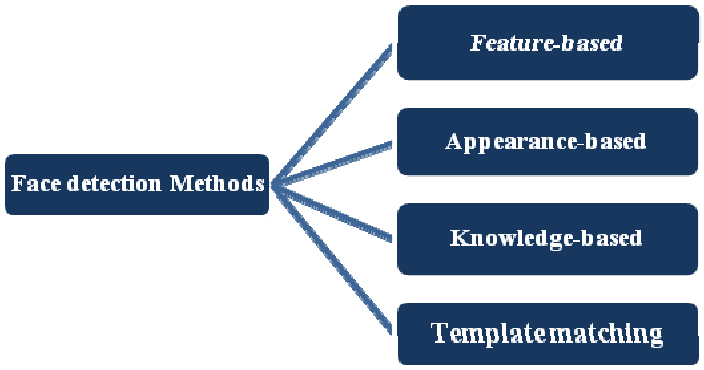

# 
Face Detection

Face Detection is the first and essential step for face recognition, and it is used to detect faces in the images. It is a part of object detection and can use in many areas such as security, bio-metrics, law enforcement, entertainment, personal safety, etc.

It is used to detect faces in real time for surveillance and tracking of person or objects. It is widely used in cameras to identify multiple appearances in the frame - Mobile cameras and DSLR’s. Facebook is also using face detection algorithm to detect faces in the images and recognise them.

## Face Detection Methods

1. **Knowledge-Based:-**
    - depends on set of rules, based on human knowledge of face detection
    - <u>Example</u>: A face must have eyes, nose and mouth within certain distances and positions with each other.
    - <u>Problem</u> > difficulty in building appropriate set of rules. There could be many false positives if rules were too general or too detailed. 
    - Therefore, this approach is too insufficient and unable to find many faces.

2. **Feature-Based:-**
    - this method is to locate faces by extracting structural features. 
    - first trained as a classifier and then trained to diff. between facial and non-facial regions.
    - this approach is divided into several steps and can detect multiple faces in an image. 

3. **Template Matching:-**
    - uses pre-defined or parametrised face templates to locate and detect by the correlation between template and input-images.
    - <u>Example</u>: a human face can be divided into eyes, face contour, nose, and mouth. Also, a face model can be built by edges just by using edge detection method.
    - <u>Problem</u> > approach is simple, but inadequate for face detection.
    

4. **Appearance-Based:-**
    - depends on set of training face images to find out face models.
    - better than others
    - rely on statistical analysis and machine learning to find relevant characteristics of face.
    - also used in feature extraction for face recognition.
    - Further divided into sub methods:
        - **Eigenface-Based:-**
            - used for efficiently recognising faces using **Principal Component Analysis**
        - **Distribution-Based:-**
                - The algorithms like **PCA and Fisher’s Discriminant** can be used to define the subspace representing facial patterns. There is a trained classifier, which correctly identifies instances of the target pattern class from the background image patterns.
        - **Neural-Networks:-**
            - used in Object/Face/Emotion Detection 
        - **Support Vector Machines:-**
            - linear classifiers that maximise the margin between decision hyperplane and examples in training dataset. 
        - ****

4.5.Sparse Network of Winnows:-
They defined a sparse network of two linear units or target nodes; one represents face patterns and other for the non-face patterns. It is less time consuming and efficient.
4.6.Naive Bayes Classifiers:-
They computed the probability of a face to be present in the picture by counting the frequency of occurrence of a series of the pattern over the training images. The classifier captured the joint statistics of local appearance and position of the faces.
4.7.Hidden Markov Model:-
The states of the model would be the facial features, which usually described as strips of pixels. HMM’s commonly used along with other methods to build detection algorithms.
4.8.Information Theoretical Approach:-
Markov Random Fields (MRF) can use for face pattern and correlated features. The Markov process maximises the discrimination between classes using Kullback-Leibler divergence. Therefore this method can be used in Face Detection.
4.9.Inductive Learning:-
This approach has been used to detect faces. Algorithms like Quinlan’s C4.5 or Mitchell’s FIND-S used for this purpose.